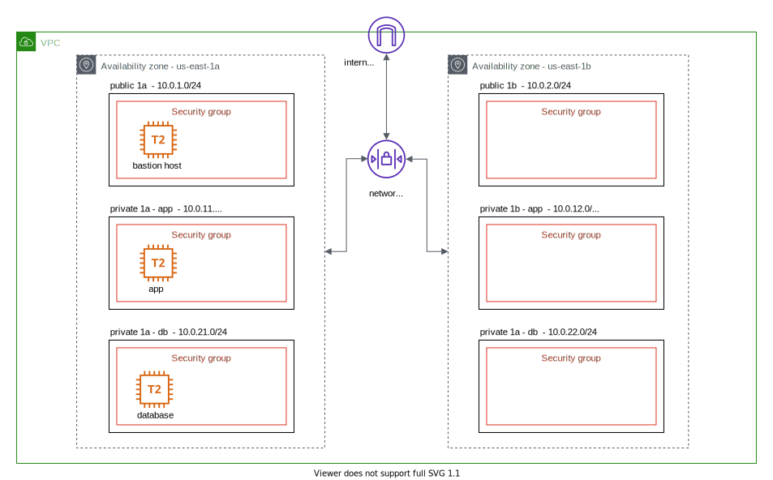

# AWS VPC & DocDB

Creating a multi AZ custom vpc (isolated network) which has both public and private access (via subnets).
In addition, create a DocumentDB within the vpc which loads and manage data using AWS lambdas.



## Table Of Contents:

- [Introduction](#Introduction)
- [Quick Start](#quick-start)
- [Notes](#notes)

## Introduction

Design a multi AZ custom vpc with public and private access via subnets. Upon creating vpc, 

setup a DocumentDB within the vpc and use lambda to load and manage csv file data uploaded AWS S3.

**Core Concepts:**

- Custom VPCs
- DocumentDB
- Connecting to DB & issuing queries from Lambda
- Bastion host and jumpbox

## Quick Start

**Technologies:**

- AWS VPC 
- AWS Network ACL
- AWS Subnets
- AWS Security groups 
- AWS Internet gateway (IGW)
- AWS EC2 
- AWS Lambda
- Terraform (>= v0.12.24)


**Setting up resources: (TODO)**


1. Add AWS secret and key to your environment (or use template below and fill in envs)

```sh

# setup-env.sh
export AWS_ACCESS_KEY_ID=<xxxx>
export AWS_SECRET_ACCESS_KEY=<xxxx>
export AWS_DEFAULT_REGION=us-east-1

. ./setup-env.sh

```

2. Export your ip address

```
export TF_VAR_local_ip_address=<your-ip-address>
```

3. Run terraform 

```

# Run the plan, and if it looks good then proceed
terraform plan


# Run the execution of setting up resources
terrfaorm apply
```

Done.

#### Accessing Bastion (public secure instance)


1. Create a `ssh-key.pem` file and copy `ssh-key` output into the file  

2. Update permission of the `ssh-key.pem` file  

```sh
chmod 400 ssh-key.pem
```

3. copy the `public ip` of instance and ssh into it   

```sh
ssh -i ./ssh-key.pem ec2-user@<bastion_instance_ip>
```

4. Verify internet access (via internet gateway)  

```sh
# Get current ip address
curl ifconfig.me.


# Try pinging and receiving packets, It should work fine 
ping 1.1.1.1

# Example
#PING 1.1.1.1 (1.1.1.1) 56(84) bytes of data.
#64 bytes from 1.1.1.1: icmp_seq=1 ttl=54 time=0.728 ms
#64 bytes from 1.1.1.1: icmp_seq=2 ttl=54 time=0.709 ms
#64 bytes from 1.1.1.1: icmp_seq=3 ttl=54 time=0.782 ms
```

#### Accessing Private instance (private)


1. Add key to key-chain 

```sh

ssh-add -k ssh-key.pem (your pem file)

```

2. Verify the key is added 

```sh
ssh-add -L
```

3. ssh into the basion instance 

```sh
ssh -A ec2-user@<bastion_instance_ip>
```

4. ssh into the private instance within the vpc

```sh
# For example
ssh ec2-user@<private_instance_ip>
```

5. Verify no internet access

```
# It should be stuck
ping 1.1.1.1
```

#### Finishing (**Important**)

1. Destroy resources (to not incur charges) 

```sh
terraform destroy -auto-approve
```

## Notes

TBA
